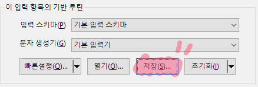
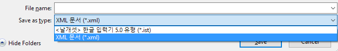
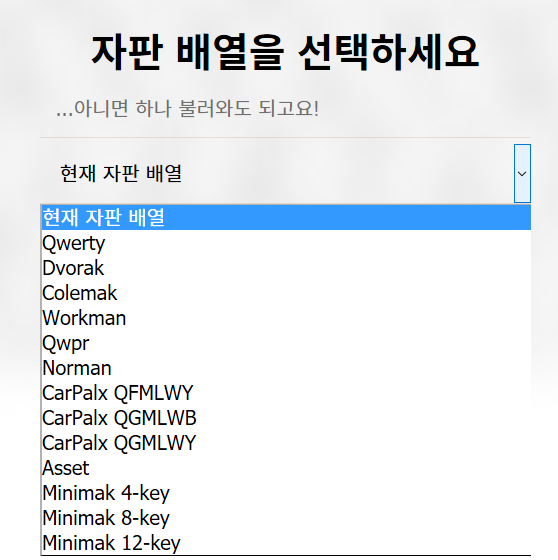
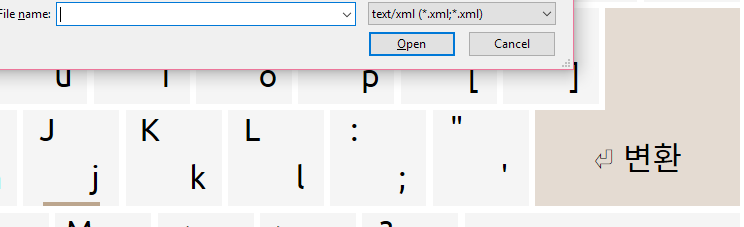
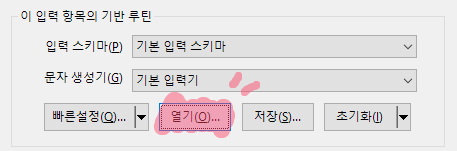
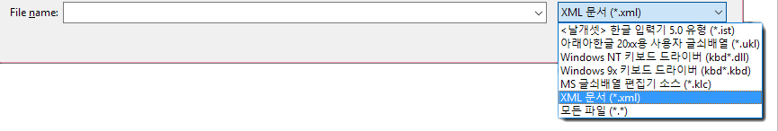

https://xnuk.github.io/ngconverter

Firefox Developer Edition 42.0a2에서 잘 작동합니다. 나머지 브라우저들은 내 알 바 아닌데 정 답답하면 포크해서 뜯어 고치든 하세요

사용법
---

일단 ist 파일이건 뭐시기건 날개셋에 불러온 다음 xml 파일로 저장합니다.

https://xnuk.github.io/ngconverter 에서 `자판 배열` 버튼을 눌러 자판 배열을 선택한 후 적용합니다.

`변환` 버튼을 눌러 저장한 xml 파일을 불러온 다음 다운로드되는 xml 파일을 저장합니다.

날개셋 제어판으로 다시 들어가 아까 다운로드한 파일을 열면 됩니다.